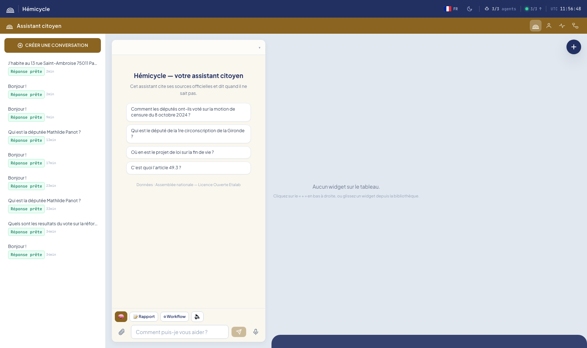

# DEFI.md

### Nom du défi
Hémicycle — Assistant citoyen de l'Assemblée nationale

### Description courte
Un citoyen pose une question en langage naturel (« Comment mon député a-t-il voté ? », « Où en est la loi sur… ? », « C'est quoi le 49.3 ? ») et reçoit une réponse vulgarisée, neutre et sourcée, construite en direct par des agents spécialisés sur les données officielles ouvertes de l'Assemblée nationale — avec le parcours de réflexion et de délégation de l'IA visible dans le chat.

### Porteur
Équipe Hémicycle

### Description longue
**Le problème.** Le jargon juridique et parlementaire (navette, scrutin public, 49.3, non-votant vs abstention…) rend l'activité de l'Assemblée nationale opaque pour la plupart des citoyens, alors même que toutes les données sont publiques et ouvertes.

**La réponse : Hémicycle**, un assistant conversationnel qui transforme une question citoyenne en réponse pédagogique, enrichie de widgets visuels (graphe de votes, fiche député, timeline de loi, hémicycle interactif, agenda parlementaire, direct de la séance), le tout construit exclusivement à partir des données officielles.

**Pourquoi c'est une « IA de confiance » :**

1. **Données officielles uniquement** : scrutins, députés et dossiers législatifs sont chargés depuis data.assemblee-nationale.fr (Licence Ouverte Etalab) dans PostgreSQL. Les agents lisent cette base en **lecture seule** ; le LLM rédige avec les chiffres exacts injectés dans son prompt — il n'a pas le droit d'en inventer.
2. **Sources cliquables** : chaque réponse renvoie vers la page officielle (assemblee-nationale.fr) du scrutin, du député ou du dossier.
3. **Transparence totale** : le plan de l'orchestrateur, les agents mobilisés, chaque appel d'outil (SQL local, API, serveur MCP) et son résultat sont affichés en direct dans le « Parcours de l'IA ». Un gate humain d'approbation du plan est réactivable par un simple flag.
4. **Neutralité** : règles de rédaction strictes — aucun jugement de valeur, « non-votant » ≠ « abstention », un texte adopté n'est pas encore une loi, un absent « n'a pas pris part au vote ».
5. **Résilience** : si le LLM tombe, des replis déterministes clôturent le tour avec les données brutes sourcées — jamais de spinner infini, jamais d'invention.

**Architecture.**

```
Citoyen ──WS──▶ Frontend React (chat + widgets VoteChart / FicheDepute / TimelineLoi
                 + « Parcours de l'IA » : plan, agents, appels d'outils, sources ①②③)
                    │
             Gateway FastAPI (pont WebSocket ⇄ bus)
                    │
             NATS JetStream — personne n'appelle personne directement
                    │
             Orchestrateur FSM événementiel (routing LLM + gardes déterministes,
             vulgarisation, replis sans LLM, leases, DLQ, outbox)
              ├─▶ agent_votes    ─┐
              ├─▶ agent_deputes  ─┼─ PostgreSQL 16 (open data AN, lecture seule)
              └─▶ agent_lois     ─┘  + serveurs MCP du hackathon (échec-doux)
```

- **Orchestration multi-agents** : machine à états événementielle sur NATS JetStream ; chaque agent domaine (votes, députés, lois) dispose de ses propres outils et sources.
- **Serveurs MCP du hackathon** : client MCP Streamable HTTP intégré ; les serveurs `mcp-moulineuse` et `mcp-parlement` se branchent en renseignant leur URL dans `.env` — URL absente = étape ignorée et tracée honnêtement dans l'interface.
- **État** : tout vit dans PostgreSQL/JetStream, rien en RAM — un service qui crashe redémarre et reprend.

**Données exploitées.**

| Jeu | Source | Usage |
|---|---|---|
| Scrutins 17e législature (~1,5 M positions de vote) | data.assemblee-nationale.fr | agent_votes |
| Acteurs / mandats / organes (tous députés, y compris mandats clos) | data.assemblee-nationale.fr | agent_deputes |
| Dossiers législatifs | data.assemblee-nationale.fr | agent_lois |
| Circonscriptions législatives (GeoJSON) | data.gouv.fr | député par adresse |

**Déroulé de la démo.** `docker compose up -d`, chargement de l'open data AN (~5-10 min), puis conversation libre : votes d'un député, état d'un dossier législatif, explication d'une notion parlementaire, recherche de son député par adresse — chaque réponse montrant ses sources et le parcours complet de l'IA.

### Image principale


### Contributeurs
- Maxime Ianni
- Joseph Menard

### Ressources utilisées
Cochez les ressources utilisées en remplaçant `[ ]` par `[x]`.

- [ ] `openfisca-france-parameters` — Base de données de paramètres ✺ OpenFisca
- [x] `an-dossiers-legislatifs` — Dossiers législatifs de l'Assemblée nationale (législature courante) ✺ Assemblée nationale
- [ ] `an-amendements-xvii` — Amendements déposés à l'Assemblée nationale (législature actuelle) ✺ Assemblée nationale
- [ ] `an-comptes-rendus` — Comptes rendus de la séance publique à l'Assemblée nationale (législature actuelle) ✺ Assemblée nationale
- [x] `an-votes-xvii` — Votes des députés (législature actuelle) ✺ Assemblée nationale
- [x] `an-deputes-en-exercice` — Députés en exercice ✺ Assemblée nationale
- [x] `an-deputes-historique` — Historique des députés ✺ Assemblée nationale
- [ ] `an-deputes-senateurs-ministres-par-legislature` — Députés, sénateurs et ministres d'une législature ✺ Assemblée nationale
- [ ] `an-agenda-reunions` — Agenda des réunions à l'Assemblée nationale (législature courante) ✺ Assemblée nationale
- [ ] `an-questions-gouvernement` — Questions de l'Assemblée nationale au Gouvernement ✺ Assemblée nationale
- [ ] `an-questions-gouvernement-ecrites` — Questions écrites de l'Assemblée nationale au Gouvernement ✺ Assemblée nationale
- [ ] `an-questions-gouvernement-orales` — Questions orales de l'Assemblée nationale au Gouvernement ✺ Assemblée nationale
- [ ] `premier-ministre-legi` — Codes, lois et règlements consolidés ✺ Premier ministre
- [ ] `premier-ministre-dole` — Dossiers législatifs Légifrance ✺ Premier ministre
- [ ] `premier-ministre-jorf` — Édition ''Lois et décrets'' du Journal officiel ✺ Premier ministre
- [ ] `senat-dispositifs-textes` — Dispositifs des textes déposés ou adoptés au Sénat ✺ Sénat
- [ ] `senat-dossiers-legislatifs` — Dossiers législatifs du Sénat ✺ Sénat
- [ ] `senat-amendements` — Amendements déposés au Sénat ✺ Sénat
- [ ] `senat-senateurs` — Sénateurs ✺ Sénat
- [ ] `senat-questions-gouvernement` — Questions orales et écrites du Sénat au Gouvernement ✺ Sénat
- [ ] `senat-comptes-rendus` — Comptes rendus de la séance publique au Sénat ✺ Sénat
- [ ] `an-et-co-database-regroupement-toutes-donnees` — Base de données unifiée Parlement / Législation / Service Public ✺ Assemblée nationale & communauté
- [x] `an-et-co-serveur-mcp-regroupement-toutes-donnees` — Serveur MCP  - Accès unifié Parlement / Législation / Service Public ✺ Assemblée nationale & communauté
- [ ] `an-et-co-api-regroupement-toutes-donnees` — API - Accès unifié Parlement / Législation / Service Public ✺ Assemblée nationale & communauté
- [ ] `legiwatch-api-parlement` — API Parlement ✺ LegiWatch
- [ ] `legiwatch-database-parlement` — Base de données Parlement ✺ LegiWatch
- [x] `legiwatch-serveur-mcp-parlement` — Serveur MCP Parlement ✺ LegiWatch

### Galerie
- [Hémicycle interactif](images/hemicycle.png)
- [Graphe de votes](images/vote-chart.png)
- [Parcours de l'IA](images/parcours-ia.png)
- [Agenda parlementaire](images/agenda.png)

### Documents
- [Sources de données](docs/data-sources.md)
- [Catalogue MCP](docs/mcp-catalog.md)

### URL de démonstration
Démonstration locale : `docker compose up -d` puis http://localhost:5173

### Diapositives de présentation
[Diapositives de présentation](docs/diapositives.pdf)
